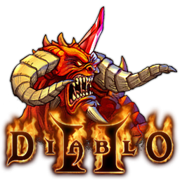

# Diablo LOD: II Based On AMXX

## About this project

[Original Author xbatista](https://forums.alliedmods.net/member.php?u=35716)

It's more like a deathmatch style mod , buyzone is restricted , all objectives removed, players have only knifes, you can attack your teammates, model of knife is changed.
When you connect to the server firstly you must create your character , then you load it and after X time you're spawned, it's controllable by cvar.
You can also delete your character, each character have their heroes, each hero have their special abbilities and skills.
Killing enemy you get more experience, gold and with needed experience value you get new level , new stats points, new skills points, by the new level you can raise your stats , which gives you more power, skills with which you can cast your magic skills.
There are also NPC ( A fake players that stands on the ground ) , you can go near them and press 'E' button to do some actions, each NPC have their own specialities, like Akara NPC sells potions , you can drink those potions and your health, mana grows up. Charsi NPC sells any kinds of items, you can buy/sell/repair/wear them, whem you wear those items each item gives you some effects, like more damage, armor, max health etc. Inventory NPC is a box where you can put your gold, items, potions.
Mana is a magic points , they are needed to cast some magic skills.
You can also trade/give items with other players.
